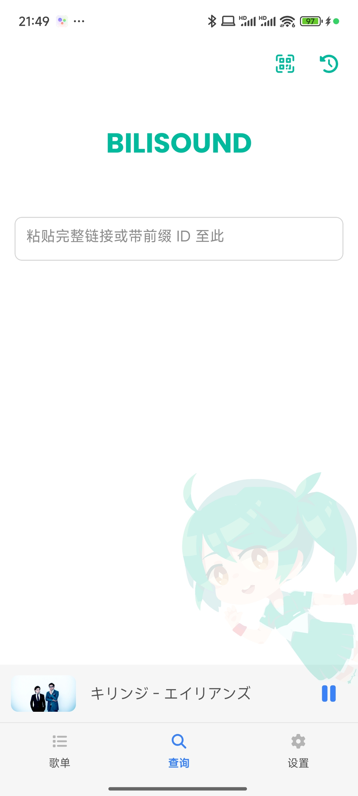
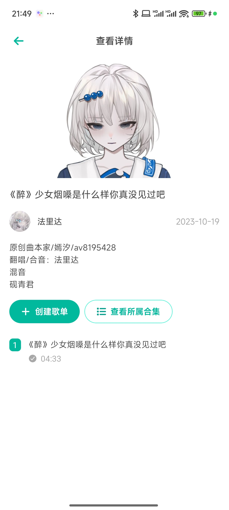
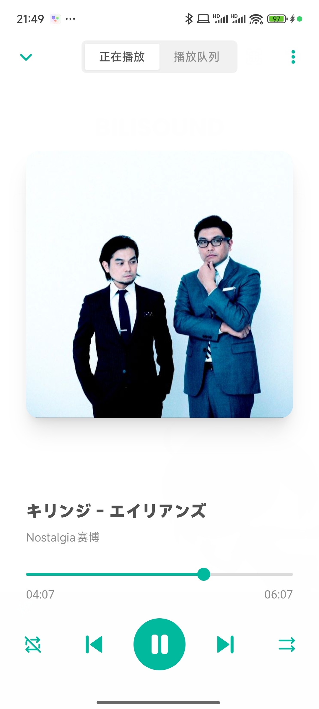
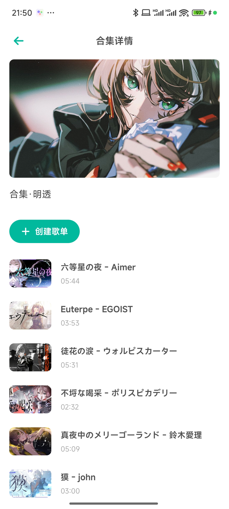
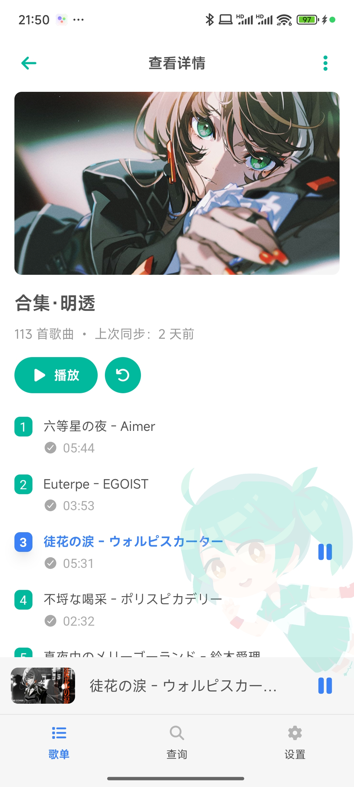
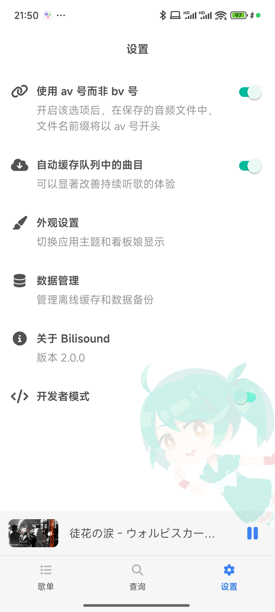

# Bilisound 移动客户端

基于 React Native (Expo) 的 Bilisound 移动客户端。

---

<table>
<tbody>
<tr>
<td></td>
<td></td>
<td></td>
</tr>
<tr>
<td></td>
<td></td>
<td></td>
</tr>
</tbody>
</table>

## 下载

Android 用户可以直接在本 GitHub 项目的 Releases 栏目下载 APK 文件。iOS 用户需要自行 clone、编译项目，并使用自己的开发者证书安装到手机上使用。

## 设备兼容性

目前支持 Android 7.1 及以上版本、iOS 17.0 及以上版本，适配手机（含折叠屏设备）及平板。macOS 电脑可以使用，但是布局尚未对大屏设备做完整适配。

暂不支持电视与手表设备。

## 敏感权限说明

### 【可选】摄像头

用于进行二维码扫描，以便快速用 Bilisound 打开在电脑上分享的视频与播放列表。

关闭权限以后不会影响程序本体工作，但是将无法扫描二维码。

## 许可证

GPLv3
