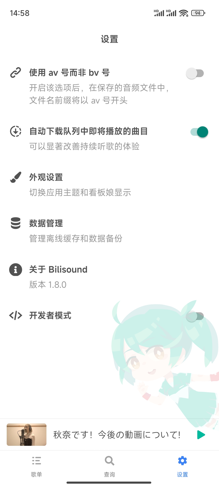

# Bilisound 客户端

基于 React Native (Expo) 的 Bilisound 客户端，支持 iOS、Android 和 Web 三个平台。

---

<table>
<tbody>
<tr>
<td></td>
<td></td>
<td></td>
</tr>
<tr>
<td></td>
<td></td>
<td></td>
</tr>
</tbody>
</table>

## 下载

Android 用户可以直接在本 GitHub 项目的 Releases 栏目下载 APK 文件。iOS 用户需要自行 clone、编译项目，并使用自己的开发者证书安装到手机上使用。

## 设备兼容性

目前支持 Android 7.1 (64 位 ARM CPU) 及以上版本（包括非 Harmony NEXT 版本的 HarmonyOS）、iOS 17.0 及以上版本，适配手机（含折叠屏设备）及平板。同时兼容 macOS (Catalyst)，但是目前存在一些体验上的问题尚待解决。

暂不支持电视与手表设备。

## 敏感权限说明

### 【可选】摄像头

用于进行二维码扫描，以便快速用 Bilisound 打开在电脑上分享的视频与播放列表。

关闭权限以后不会影响程序本体工作，但是将无法扫描二维码。

## 技术栈

| 名称                                                                    | 简介                                 |
|-----------------------------------------------------------------------|------------------------------------|
| [Expo](https://expo.dev/)                                             | 基于 React Native 的跨端框架              |
| [React Query](https://tanstack.com/query/latest)                      | 异步请求状态管理                           |
| [FFmpegKit for React Native](https://github.com/arthenica/ffmpeg-kit) | 音频提取和转码处理                          |
| [Zustand](https://zustand-demo.pmnd.rs/)                              | React 全局状态管理                       |
| [react-native-mmkv](https://github.com/mrousavy/react-native-mmkv)    | 持久化键值对存储                           |

## 开发模式

由于本项目引用了若干带有原生代码的第三方库，因此不能使用 Expo Go。开发前，请根据 [这篇文档](https://docs.expo.dev/guides/local-app-development/) 的说明设置好开发环境，构建 Development build 进行开发。

### iOS

```bash
pnpm run ios
```

### Android

```bash
pnpm run android
```

### Web (Beta，不同于当前线上 Web 版)

```bash
pnpm run web
```

## 构建生产版本

构建生产版本以前，需要准备好 keystore 文件 (Android)……

### Android

```bash
pnpm run build:android
```
