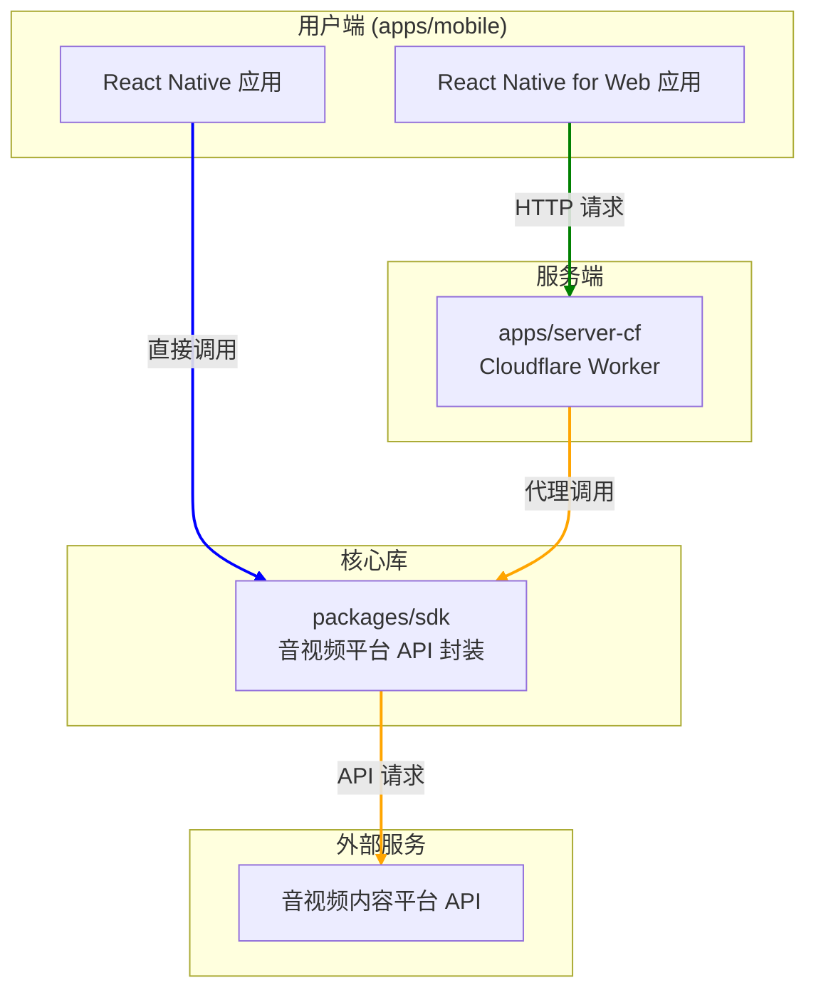

# Bilisound 客户端项目架构

## 1. 项目概述
Bilisound 是一个第三方音视频客户端，采用 monorepo 结构，支持 iOS、Android 和 Web 平台。项目旨在提供一个纯净、专注的音视频播放体验，特别是针对播放列表和离线使用的场景。

## 2. 项目目标
- **跨平台体验**: 提供在移动端和 Web 上一致的用户体验。
- **播放列表中心**: 方便用户创建、管理和分享音视频播放列表（歌单）。
- **离线播放**: 支持将音视频内容下载到本地，供离线使用。
- **纯净播放**: 专注于核心的播放功能，无广告和不相关的社交元素。

## 3. 技术栈
- **包管理器**: pnpm
- **构建系统**: Turborepo
- **移动端框架**: React Native & Expo
- **Web框架**: React Native for Web
- **后端服务**: Cloudflare Workers
- **UI**: Tailwind CSS (via NativeWind), gluestack-ui
- **状态管理**: Zustand
- **数据库**: Drizzle ORM + SQLite
- **类型系统**: TypeScript

## 4. 整体架构图

*   **蓝色箭头**: 原生 App（iOS/Android）的数据流。它直接使用 `packages/sdk` 与音视频内容平台 API 通信。
*   **橙色箭头**: Web App 的数据流。它通过 `apps/server-cf` 后端服务代理所有对音视频内容平台 API 的请求，以规避浏览器的跨域限制。

## 5. 项目结构与模块职责

### `apps/mobile/`
这是项目的主应用，包含了所有的 UI 界面、业务逻辑和状态管理。
- **平台**: 基于 Expo 和 React Native，可同时构建到 iOS, Android 和 Web。
- **目录结构**:
    - `app/`: 页面路由，遵循 Expo Router 的文件路由规范。
    - `components/`: 可复用的 UI 组件。
    - `store/`: Zustand 状态管理模块。
    - `storage/`: 数据库（SQLite）和本地存储相关逻辑。
    - `business/`: 核心业务逻辑，如下载、播放列表处理等。
    - `api/`: 应用层 API 封装，处理原生和 Web 端的数据请求分发。

### `apps/server-cf/`
一个部署在 Cloudflare Workers 上的轻量级后端服务。
- **主要职责**: 作为 Web 端访问音视频内容平台 API 的代理。由于浏览器安全策略（CORS），Web 端无法直接请求音视频内容平台 API，因此需要通过这个服务器进行转发。
- **实现**: 使用 Hono 框架构建，简单、高效。

### `packages/sdk/`
共享的软件开发工具包（SDK），用于封装与音视频内容平台 API 的交互逻辑。
- **主要职责**: 提供统一、简洁的函数来获取音视频内容平台的视频信息、播放地址、用户列表等。它处理了 API 签名、参数构造等复杂细节。
- **复用性**: 被 `apps/mobile` (原生端) 直接调用，同时其逻辑也被 `apps/server-cf` 在服务端复用。

## 6. 核心功能实现

### 平台差异性处理
项目在多个文件中使用了 `Platform.OS === 'web'` 的判断来执行不同平台的代码，尤其是在 API 请求模块 (`apps/mobile/api/bilisound.ts`)。
- **原生端**: 直接调用 `packages/sdk` 中的函数，向音视频内容平台 API 发起请求。
- **Web端**: 请求发送到 `apps/server-cf` 提供的接口，由后者代为请求音视频内容平台 API。

### 状态管理
项目使用 Zustand 进行全局状态管理，它以其简洁的 API 和基于 Hooks 的特性而闻名。
- **模块化**: 状态被分割到不同的 "slice" 中，例如 `download.ts`, `settings.ts` 等，分别管理不同模块的状态，便于维护。
- **位置**: `apps/mobile/store/`

### 数据持久化
- **数据库**: 使用 Drizzle ORM 配合 Expo SQLite，提供类型安全的关系型数据存储能力，主要用于存储播放列表、音视频信息等。
- **文件存储**: 使用 Expo FileSystem 来管理下载的音视频文件和封面图片。

## 7. 总结
Bilisound 项目是一个架构设计清晰、技术选型现代化的全栈应用。它通过 Monorepo 有效地组织了前端、后端和共享库代码。对原生和 Web 平台的差异化处理方案，以及对核心业务逻辑的良好封装，使其成为一个高质量的 React Native 跨平台项目典范。
